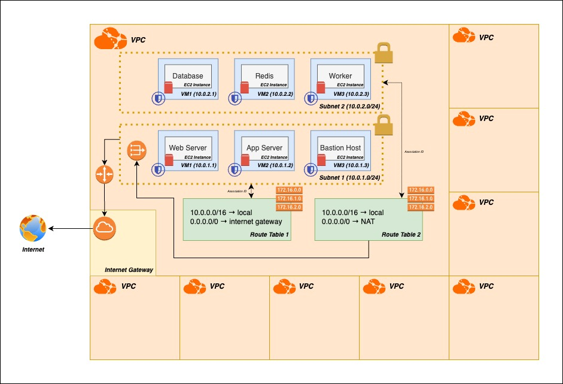

## 🏨 AWS VPC Networking Explained with a Hotel Analogy

To help demystify AWS networking for beginners, I created a simplified analogy—and a diagram—to visualize key concepts.  
**Disclaimer:** This example is *not* an exact representation of the **Kubernetes the Hard Way** architecture, but rather a standalone illustration designed to aid understanding.

### 🌐 The Analogy: AWS as a Hotel

Think of your **VPC (Virtual Private Cloud)** as an entire **hotel building** you own.

- 🏢 **VPC = The hotel**  
  A private building where only your guests (resources) can stay. Everything inside is isolated from other customers' hotels (VPCs).

- 🛗 **Subnets = The floors of the hotel**  
  Each floor (subnet) can house different guests (EC2 instances). Some may be public (connected to the internet), others private (isolated inside the building).

- 🚪 **EC2 instances = Hotel rooms with guests**  
  Your compute resources (like web servers or databases) are like individual rooms with their own keys (SSH), IP addresses, and isolated environments.

- 🗺️ **Route Tables = Floor plans**  
  These tell guests how to get around—within the hotel, or to the outside world.  
  If a guest wants to go to the internet, they’ll need directions (a route) via the **Internet Gateway** or **NAT Gateway**.

- 🌐 **Internet Gateway = Hotel main entrance**  
  Lets guests on public floors (subnets) go outside to the internet directly.

- 🛜 **NAT Gateway = Concierge that makes outbound calls for private rooms**  
  Guests in private rooms can’t go outside directly. Instead, the concierge (NAT) makes the request on their behalf and returns with a response.

- 🛡️ **Security Groups = Room security**  
  Like bouncers outside each door, controlling who’s allowed to enter or talk to each room.

- 📦 **EBS Volumes = Luggage stored in the room**  
  These are your persistent data disks attached to EC2 instances.

---

This analogy makes it easier to understand what you’re building and configuring in AWS, especially when setting up foundational resources like VPCs, subnets, and instances.

📌 *See the diagram below for visual reference.*

